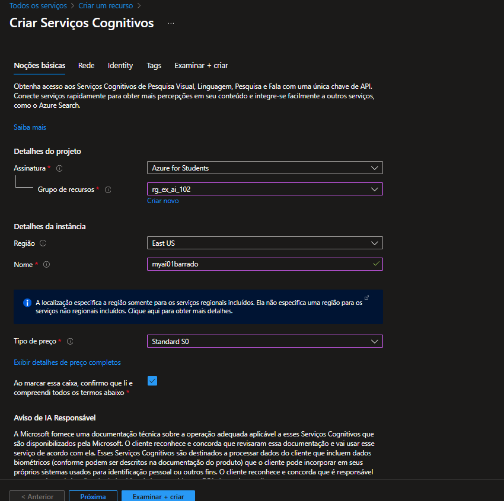
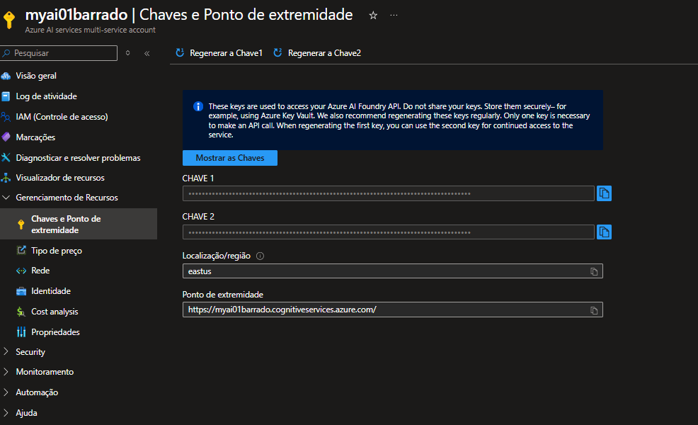

# Provisionando um Recurso de Serviços de IA do Azure

Para provisionar um recurso único dos Serviços de IA do Azure, siga os passos abaixo:

## 1. Acesse o Portal do Azure

Vá para [portal.azure.com](https://portal.azure.com).

## 2. Crie um Novo Recurso

1. Clique em **Criar um recurso**.
2. Pesquise por **Serviços Cognitivos** ou o serviço de IA desejado (por exemplo, "Azure OpenAI", "Computer Vision", etc.).
3. Selecione o serviço e clique em **Criar**.

## 3. Configure o Recurso

- **Assinatura:** Selecione sua assinatura do Azure.
- **Grupo de Recursos:** Escolha um existente ou crie um novo.
- **Região:** Selecione a região desejada.
- **Nome:** Defina um nome exclusivo para o recurso.
- **Plano de Preço:** Escolha o plano adequado.




## 4. Revise e Crie

- Revise as configurações.
- Clique em **Criar** para provisionar o recurso.

## 5. Acesse as Chaves e Endpoint

Após a implantação, acesse o recurso para obter as **chaves de acesso** e o **endpoint** necessários para integrar o serviço à sua aplicação.



- Um ponto de extremidade HTTP para o qual os aplicativos clientes podem enviar solicitações.
- Duas chaves que podem ser usadas para autenticação (aplicativos cliente podem usar qualquer uma das chaves para autenticação).
- O local onde o recurso está hospedado. Isso é necessário para solicitações a algumas APIs (mas não a todas).

## 6. Usando interface REST

1. Veja o conteúdo da pasta rest-client e observe que ela contém um arquivo para definições de configuração:
    - C# : appsettings.json

> Abra o arquivo de configuração e atualize os valores de configuração contidos nele para refletir o ponto de extremidade e uma chave de autenticação para o seu recurso de serviços de IA do Azure. Salve as alterações.

````json
{
    "AIServicesEndpoint": "YOUR_AI_SERVICES_ENDPOINT",
    "AIServicesKey": "YOUR_AI_SERVICES_KEY"
}
````

2. Observe que a pasta rest-client contém um arquivo de código para o aplicativo cliente:
    - C# : Programa.cs

Abra o arquivo de código e revise o código que ele contém, observando os seguintes detalhes:

Vários namespaces são importados para permitir a comunicação HTTP
- O código na função Main recupera o ponto de extremidade e a chave para o recurso de serviços de IA do Azure. Eles serão usados para enviar solicitações REST ao serviço de Análise de Texto.
- O programa aceita a entrada do usuário e usa a função GetLanguage para chamar a API REST de detecção de idioma do Text Analytics para o seu ponto de extremidade de serviços de IA do Azure para detectar o idioma do texto que foi inserido.
- A solicitação enviada à API consiste em um objeto JSON contendo os dados de entrada - neste caso, uma coleção de objetos de documento , cada um dos quais tem um id e um texto .
- A chave do seu serviço está incluída no cabeçalho da solicitação para autenticar seu aplicativo cliente.
- A resposta do serviço é um objeto JSON, que o aplicativo cliente pode analisar.

````C#
using System;
using Newtonsoft.Json.Linq;
using System.Text;
using System.Net.Http;
using System.Net.Http.Headers;
using System.Web;
using Microsoft.Extensions.Configuration;
using System.Threading.Tasks;

namespace rest_client
{
    class Program
    {
        private static string AiSvcEndpoint;
        private static string AiSvCKey;
        static async Task Main(string[] args)
        {
            try
            {
                // Get config settings from AppSettings
                IConfigurationBuilder builder = new ConfigurationBuilder().AddJsonFile("appsettings.json");
                IConfigurationRoot configuration = builder.Build();
                AiSvcEndpoint = configuration["AIServicesEndpoint"];
                AiSvCKey = configuration["AIServicesKey"];


                // Get user input (until they enter "quit")
                string userText = "";
                while (userText.ToLower() != "quit")
                {
                    Console.WriteLine("Enter some text ('quit' to stop)");
                    userText = Console.ReadLine();
                    if (userText.ToLower() != "quit")
                    {
                        // Call function to detect language
                        await GetLanguage(userText);
                    }

                }
            }
            catch (Exception ex)
            {
                Console.WriteLine(ex.Message);
            }
        }
        static async Task GetLanguage(string text)
        {
            // Construct the JSON request body
            try
            {
                JObject jsonBody = new JObject(
                    // Create a collection of documents (we'll only use one, but you could have more)
                    new JProperty("documents",
                    new JArray(
                        new JObject(
                            // Each document needs a unique ID and some text
                            new JProperty("id", 1),
                            new JProperty("text", text)
                    ))));
                
                // Encode as UTF-8
                UTF8Encoding utf8 = new UTF8Encoding(true, true);
                byte[] encodedBytes = utf8.GetBytes(jsonBody.ToString());
                
                // Let's take a look at the JSON we'll send to the service
                Console.WriteLine(utf8.GetString(encodedBytes, 0, encodedBytes.Length));

                // Make an HTTP request to the REST interface
                var client = new HttpClient();
                var queryString = HttpUtility.ParseQueryString(string.Empty);

                // Add the authentication key to the header
                client.DefaultRequestHeaders.Add("Ocp-Apim-Subscription-Key", AiSvCKey);

                // Use the endpoint to access the Text Analytics language API
                var uri = AiSvcEndpoint + "text/analytics/v3.1/languages?" + queryString;

                // Send the request and get the response
                HttpResponseMessage response;
                using (var content = new ByteArrayContent(encodedBytes))
                {
                    content.Headers.ContentType = new MediaTypeHeaderValue("application/json");
                    response = await client.PostAsync(uri, content);
                }

                // If the call was successful, get the response
                if (response.StatusCode == System.Net.HttpStatusCode.OK)
                {
                    // Display the JSON response in full (just so we can see it)
                    string responseContent = await response.Content.ReadAsStringAsync();
                    JObject results = JObject.Parse(responseContent);
                    Console.WriteLine(results.ToString());

                    // Extract the detected language name for each document
                    foreach (JObject document in results["documents"])
                    {
                        Console.WriteLine("\nLanguage: " + (string)document["detectedLanguage"]["name"]);
                    }
                }
                else
                {
                    // Something went wrong, write the whole response
                    Console.WriteLine(response.ToString());
                }
            }
            catch(Exception ex)
            {
                Console.WriteLine(ex.Message);
            }

        }
    }
}
````

3. Clique com o botão direito do mouse na pasta rest-client , selecione Abrir no Terminal Integrado e execute o seguinte comando:

````C#
 dotnet run
````

## Usando um SDK

1. No Visual Studio Code, expanda a pasta sdk-client ````cd .. /sdk-client````
2. Instale o pacote Text Analytics SDK executando o comando apropriado para sua preferência de idioma:

````C#
 dotnet add package Azure.AI.TextAnalytics --version 5.3.0
 ````
3. Veja o conteúdo da pasta sdk-client e observe que ela contém um arquivo para definições de configuração:
    - C# : appsettings.json

> Abra o arquivo de configuração e atualize os valores de configuração contidos nele para refletir o ponto

4. Observe que a pasta sdk-client contém um arquivo de código para o aplicativo cliente:
    - C# : Programa.cs
Abra o arquivo de código e revise o código que ele contém, observando os seguintes detalhes:

- O namespace do SDK que você instalou é importado
- O código na função Principal recupera o ponto de extremidade e a chave para o recurso de serviços de IA do Azure. Eles serão usados com o SDK para criar um cliente para o serviço de Análise de Texto.
- A função GetLanguage usa o SDK para criar um cliente para o serviço e, em seguida, usa o cliente para detectar o idioma do texto que foi inserido.

````C#
using System;
using Azure;
using Microsoft.Extensions.Configuration;
using System.Text;
using Azure.AI.TextAnalytics;

namespace sdk_client
{
    class Program
    {

        private static string AISvcEndpoint;
        private static string AISvcKey;
        static void Main(string[] args)
        {
            try
            {
                // Get config settings from AppSettings
                IConfigurationBuilder builder = new ConfigurationBuilder().AddJsonFile("appsettings.json");
                IConfigurationRoot configuration = builder.Build();
                AISvcEndpoint = configuration["AIServicesEndpoint"];
                AISvcKey = configuration["AIServicesKey"];

                // Get user input (until they enter "quit")
                string userText = "";
                while (userText.ToLower() != "quit")
                {
                    Console.WriteLine("\nEnter some text ('quit' to stop)");
                    userText = Console.ReadLine();
                    if (userText.ToLower() != "quit")
                    {
                        // Call function to detect language
                        string language = GetLanguage(userText);
                        Console.WriteLine("Language: " + language);
                    }

                }
            }
            catch (Exception ex)
            {
                Console.WriteLine(ex.Message);
            }
        }
        static string GetLanguage(string text)
        {

            // Create client using endpoint and key
            AzureKeyCredential credentials = new AzureKeyCredential(AISvcKey);
            Uri endpoint = new Uri(AISvcEndpoint);
            var client = new TextAnalyticsClient(endpoint, credentials);

            // Call the service to get the detected language
            DetectedLanguage detectedLanguage = client.DetectLanguage(text);
            return(detectedLanguage.Name);

        }
    }
}
````
5. Retorne ao terminal, certifique-se de estar na pasta sdk-client e digite o seguinte comando para executar o programa:

````C#
 dotnet run
````

---


**Dica:** Você também pode usar o Azure CLI para criar recursos. Exemplo para Serviços Cognitivos:

```bash
az cognitiveservices account create \
    --name <NOME_DO_RECURSO> \
    --resource-group <GRUPO_DE_RECURSO> \
    --kind <TIPO_DO_SERVIÇO> \
    --sku S0 \
    --location <REGIÃO>
```