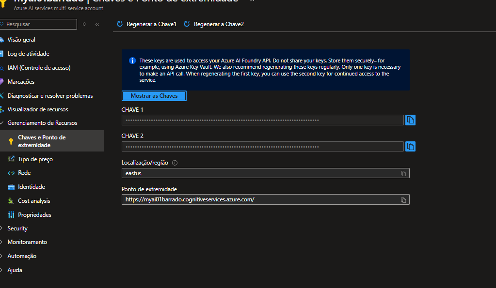
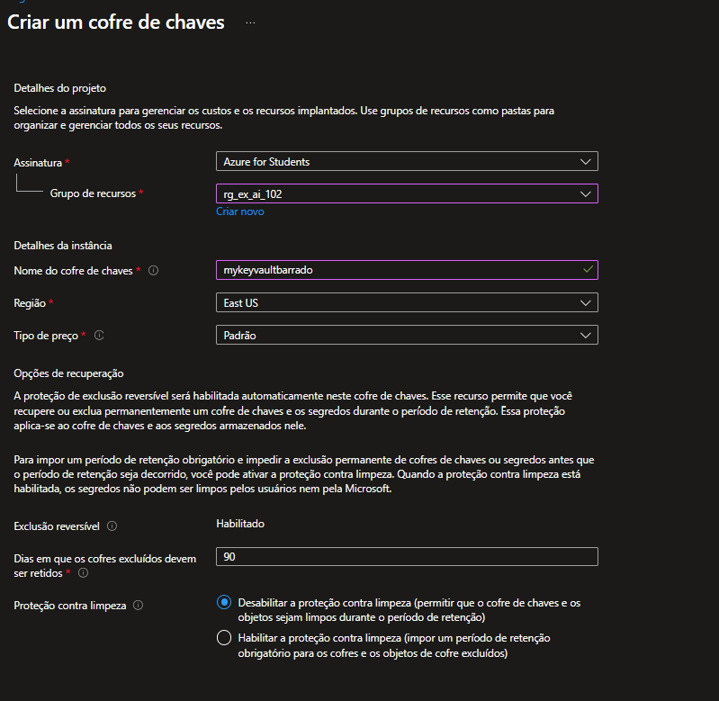
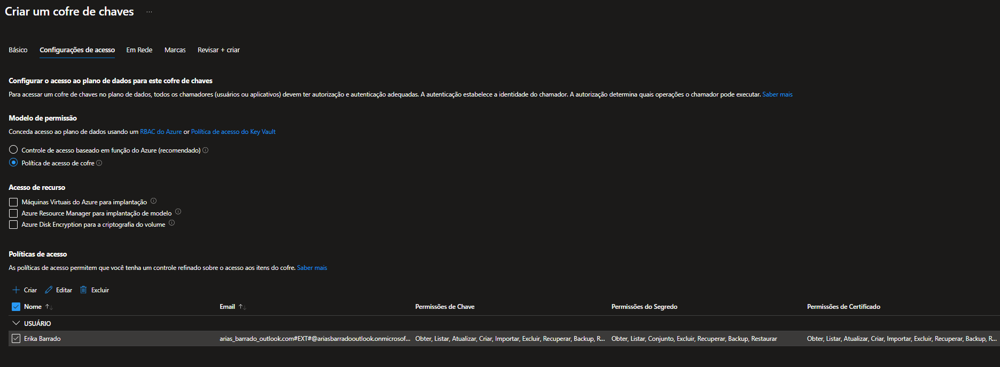
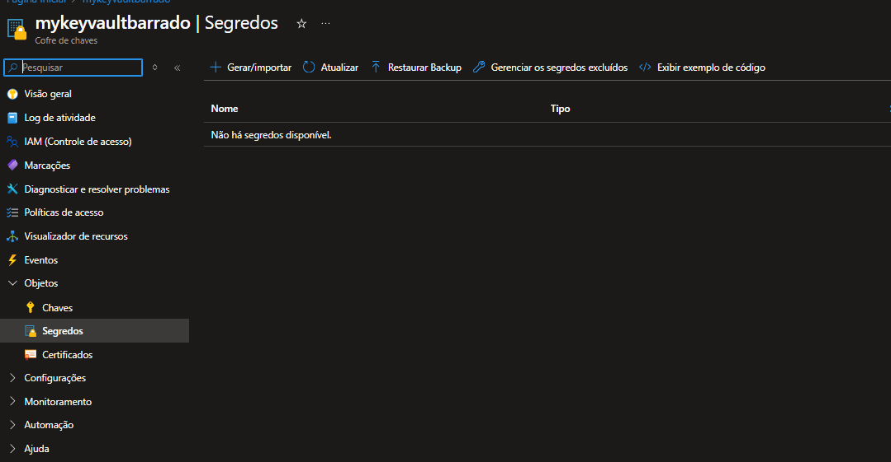
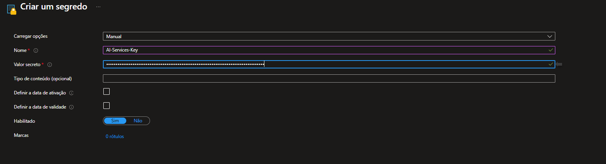

# Gerenciar a segurança dos serviços de IA do Azure

O acesso aos serviços de IA do Azure normalmente é controlado por meio de chaves de autenticação, que são geradas quandoo você cria inicialmente um recurso de serviços de IA do Azure

# Provissionar um recurso do Azure AI Services

1. Abra o [portal do Azure](https://portal.azure.com)
2. Pesquise por Serviços de IA do Azure, crie um recursos com as configurações:
    - Assinatura : Sua assinatura do Azure
    - Grupo de recursos : escolha ou crie um grupo de recursos (se estiver usando uma assinatura restrita, talvez você não tenha permissão para criar um novo grupo de recursos - use o fornecido)
    - Região : Escolha qualquer região disponível
    - Nome : Insira um nome exclusivo
    - Nível de preço : Standard S0

# Gerenciar chaves de autenticação

Ao criar seu recurso de serviços de IA do Azure, duas chaves de autenticação foram geradas. Você pode gerenciá-las no portal do Azure ou usando a interface de linha de comando (CLI) do Azure.



- No portal do Azure, acesse o recurso de serviços de IA do Azure e visualize a página Chaves e Ponto de Extremidade
    - Um ponto de extremidade HTTP para o qual os aplicativos clientes podem enviar solicitações.
    - Duas chaves que podem ser usadas para autenticação (aplicativos cliente podem usar qualquer uma das chaves. Uma prática comum é usar uma para desenvolvimento e outra para produção. Você pode facilmente regenerar a chave de desenvolvimento depois que os desenvolvedores terminarem seu trabalho para impedir o acesso contínuo).
    - O local onde o recurso está hospedado. Isso é necessário para solicitações a algumas APIs (mas não a todas).

### Usando linha de comando

````bash
     az cognitiveservices account keys list --name <resourceName> --resource-group <resourceGroup>
````

- O comando retorna uma lista de chaves para o seu recurso de serviços de IA do Azure. Há duas chaves, chamadas key1 e key2 .
Para testar seu serviço de IA do Azure, você pode usar curl , uma ferramenta de linha de comando para solicitações HTTP.

````bash
 curl -X POST "<yourEndpoint>/language/:analyze-text?api-version=2023-04-01" -H "Content-Type: application/json" -H "Ocp-Apim-Subscription-Key: <your-key>" --data-ascii "{'analysisInput':{'documents':[{'id':1,'text':'hello'}]}, 'kind': 'LanguageDetection'}"
 ````

- Se uma chave for comprometida ou os desenvolvedores que a possuem não precisarem mais de acesso, você poderá regenerá-la no portal ou usando a CLI do Azure. Execute o seguinte comando para regenerar sua chave key1 (substituindo <resourceName> e <resourceGroup> para o seu recurso).

````bash
 az cognitiveservices account keys regenerate --name <resourceName> --resource-group <resourceGroup> --key-name key1
 ````

 ### Acesso seguro à chave com o Azure Key Vault

Você pode desenvolver aplicativos que consomem serviços de IA do Azure usando uma chave para autenticação. No entanto, isso significa que o código do aplicativo deve ser capaz de obter a chave. Uma opção é armazenar a chave em uma variável de ambiente ou em um arquivo de configuração onde o aplicativo é implantado, mas essa abordagem deixa a chave vulnerável a acesso não autorizado. Uma abordagem melhor ao desenvolver aplicativos no Azure é armazenar a chave com segurança no Azure Key Vault e fornecer acesso a ela por meio de uma identidade gerenciada (em outras palavras, uma conta de usuário usada pelo próprio aplicativo).

**Crie um cofre de chaves e adicione um segredo**
Primeiro, você precisa criar um cofre de chaves e adicionar um segredo para a chave dos serviços de IA do Azure.

Escolha um método para criar um cofre de chaves e adicionar um segredo:

#### Usando o portal do Azure
1. Anote o valor key1 para seu recurso de serviços de IA do Azure (ou copie-o para a área de transferência).
2. No portal do Azure, na página inicial , selecione o botão ＋Criar um recurso , pesquise por Key Vault e crie um recurso Key Vault com as seguintes configurações:
    - Assinatura : Sua assinatura do Azure
    - Grupo de recursos : o mesmo grupo de recursos que o recurso do serviço de IA do Azure
    - Nome do cofre de chaves : insira um nome exclusivo
    - Região : a mesma região do seu recurso de serviço de IA do Azure
    - Nível de preço : Padrão

**Configuração de acesso**

    - Modelo de permissão : Política de acesso ao Vault    
    - Role para baixo até a seção Políticas de acesso e selecione seu usuário usando a caixa de seleção à esquerda. Em seguida, selecione Revisar + criar e, em seguida, Criar para criar seu recurso.




3. Aguarde a conclusão da implantação e acesse seu recurso de cofre de chaves.
4. No painel de navegação esquerdo, selecione **Segredos** (na seção **Objetos**).
**Selecione + Gerar/Importar** e adicione um novo segredo com as seguintes configurações:



- **Selecione + Gerar/Importar** e adicione um novo segredo com as seguintes configurações:

    - Opções de upload : Manual
    - Nome : AI-Services-Key (é importante corresponder exatamente, porque mais tarde você executará o código que recupera o segredo com base neste nome)
    - Valor secreto : Sua chave1 Chave de serviços de IA do Azure



5. Selecione Criar .

## Criar uma entidade de serviço

Para acessar o segredo no cofre de chaves, seu aplicativo deve usar uma entidade de serviço que tenha acesso ao segredo. Você usará a interface de linha de comando (CLI) do Azure para criar a entidade de serviço, encontrar seu ID de objeto e conceder acesso ao segredo no Azure Vault.

1. Execute o seguinte comando da CLI do Azure, substituindo <spName> por um nome exclusivo e adequado para a identidade do aplicativo (por exemplo, ai-app com suas iniciais anexadas no final; o nome deve ser exclusivo no seu locatário). Substitua também <subscriptionId> e <resourceGroup> pelos valores corretos para o ID da sua assinatura e o grupo de recursos que contém os serviços de IA do Azure e os recursos do Key Vault:

````bash
 az ad sp create-for-rbac -n "api://<spName>" --role owner --scopes subscriptions/<subscriptionId>/resourceGroups/<resourceGroup>
 ````

 A saída sera parecida com essa:

 ```bash
{
    "appId": "abcd12345efghi67890jklmn",
    "displayName": "api://ai-app-",
    "password": "1a2b3c4d5e6f7g8h9i0j",
    "tenant": "1234abcd5678fghi90jklm"
}
```
Anote os valores appId , password e tenant - você precisará deles mais tarde (se fechar este terminal, não será possível recuperar a senha; por isso, é importante anotar os valores agora - você pode colar a saída em um novo arquivo de texto na sua máquina local para garantir que poderá encontrar os valores necessários mais tarde!)

- Obter o **ID do Objeto**

````bash
 az ad sp show --id <appId>
 ````
 - Copie o id valor no json retornado

 - Para atribuir permissão para sua nova entidade de serviço acessar segredos no seu Key Vault, execute o seguinte comando da CLI do Azure, substituindo <keyVaultName> pelo nome do seu recurso do Azure Key Vault e <objectId> pelo valor da ID da entidade de serviço que você acabou de copiar.

 ````bash
  az keyvault set-policy -n <keyVaultName> --object-id <objectId> --secret-permissions get list
  ````

  ### Use o principal de serviço em um aplicativo

  Agora você está pronto para usar a identidade principal do serviço em um aplicativo, para que ele possa acessar a chave secreta dos serviços de IA do Azure no seu cofre de chaves e usá-la para se conectar ao seu recurso de serviços de IA do Azure.

  1. No seu terminal, acesse a pasta C-Sharp
  2. Instale os pacotes que você precisará usar para o Azure Key Vault e a API de Análise de Texto no seu recurso de serviços de IA do Azure executando o comando apropriado para sua preferência de idioma:

````C#
 dotnet add package Azure.AI.TextAnalytics --version 5.3.0
 dotnet add package Azure.Identity --version 1.12.0
 dotnet add package Azure.Security.KeyVault.Secrets --version 4.6.0
 ````

 3. Veja o conteúdo da pasta keyvault-client e observe que ela contém um arquivo para definições de configuração:
    - C# : appsettings.json

Abra o arquivo de configuração e atualize os valores de configuração que ele contém para refletir as seguintes configurações:

- O ponto de extremidade para seu recurso do Azure AI Services
- O nome do seu recurso do Azure Key Vault
- O inquilino do seu principal serviço
- O appId para o seu principal de serviço
- A senha para o seu principal serviço

````JSON
{
    "AIServicesEndpoint": "YOUR_AI_SERVICES_ENDPOINT",
    "KeyVault": "YOUR_KEY_VAULT_NAME",
    "TenantId": "YOUR_SERVICE_PRINCIPAL_TENANT_ID",
    "AppId": "YOUR_SERVICE_PRINCIPAL_APP_ID",
    "AppPassword": "YOUR_SERVICE_PRINCIPAL_PASSWORD"
}
````

Salve suas alterações pressionando CTRL+S .

4. Observe que a pasta keyvault-client contém um arquivo de código para o aplicativo cliente:
    - C# : Programa.cs

````C#
using System;
using Azure;
using Microsoft.Extensions.Configuration;
using Azure.AI.TextAnalytics;
using static System.Environment;
using Azure.Identity;
using Azure.Security.KeyVault.Secrets;

namespace keyvault_client
{
    class Program
    {

        private static string aiSvcEndpoint;
        private static string aiSvcKey;
        static void Main(string[] args)
        {
            try
            {
                // Get config settings from AppSettings
                IConfigurationBuilder builder = new ConfigurationBuilder().AddJsonFile("appsettings.json");
                IConfigurationRoot configuration = builder.Build();
                aiSvcEndpoint = configuration["AIServicesEndpoint"];
                string keyVaultName = configuration["KeyVault"];
                string appTenant = configuration["TenantId"];
                string appId = configuration["AppId"];
                string appPassword = configuration["AppPassword"];

                // Get Azure AI services key from keyvault using the service principal credentials
                var keyVaultUri = new Uri($"https://{keyVaultName}.vault.azure.net/");
                ClientSecretCredential credential = new ClientSecretCredential(appTenant, appId, appPassword);
                var keyVaultClient = new SecretClient(keyVaultUri, credential);
                KeyVaultSecret secretKey = keyVaultClient.GetSecret("AI-Services-Key");
                aiSvcKey = secretKey.Value;

                // Get user input (until they enter "quit")
                string userText = "";
                while (userText.ToLower() != "quit")
                {
                    Console.WriteLine("\nEnter some text ('quit' to stop)");
                    userText = Console.ReadLine();
                    if (userText.ToLower() != "quit")
                    {
                        // Call function to detect language
                        string language = GetLanguage(userText);
                        Console.WriteLine("Language: " + language);
                    }

                }
            }
            catch (Exception ex)
            {
                Console.WriteLine(ex.Message);
            }
        }
        static string GetLanguage(string text)
        {

            // Create client using endpoint and key
            AzureKeyCredential credentials = new AzureKeyCredential(aiSvcKey);
            Uri endpoint = new Uri(aiSvcEndpoint);
            var client = new TextAnalyticsClient(endpoint, credentials);

            // Call the service to get the detected language
            DetectedLanguage detectedLanguage = client.DetectLanguage(text);
            return(detectedLanguage.Name);

        }
    }
}
````

Abra o arquivo de código e revise o código que ele contém, observando os seguintes detalhes:

- O namespace do SDK que você instalou é importado
-  O código na função Main recupera as definições de configuração do aplicativo e, em seguida, usa as credenciais da entidade de serviço para obter a chave de serviços do Azure AI do cofre de chaves.
-  A função GetLanguage usa o SDK para criar um cliente para o serviço e, em seguida, usa o cliente para detectar o idioma do texto que foi inserido.

5.  Execute o comando:

````C#
 dotnet run
 ````